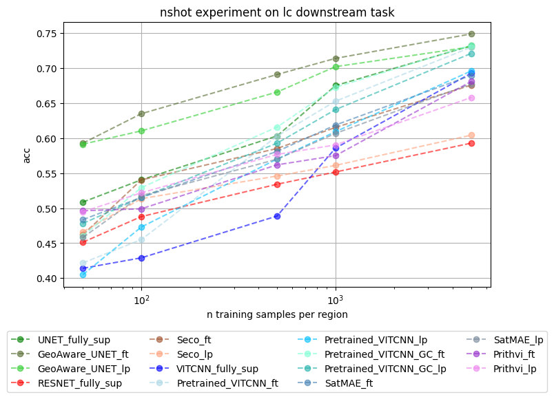

# PhilEO - Toolbox
_Foundation Models and Tools for AI-driven Analysis of Copernicus Data_

Phileo is a toolbox for AI-driven analysis of Copernicus data. It provides a set of foundation models and tools for the analysis of Copernicus data. The toolbox is designed to be modular and extensible, allowing users to easily integrate their own models and tools. The toolbox is built on top of the [PyTorch](https://pytorch.org/) library, and is designed to be easy to use and easy to extend.

Please note that PhilEO is still under development by the ESA Φ-lab and is not yet ready for production use. We are actively working on adding new features and improving the toolbox, and we welcome contributions from the community.

### Dependencies
`numba` `gdal` `pytorch`

### Installation
```python
pip install phileo-toolbox
```

### Usage
```python
from phileo_toolbox import models, tools, datasets

# Load a dataset
dataset = datasets.CopernicusDataset('sentinel_sat')
dataset_patches = dataset.get_patches(256, overlaps=None) # Get patches of size 10x256x256 from the dataset, with no overlaps

# Load a model
model = models.UNetS2(10, 1, patch_size=256, encoder_only=True, pretrained=True, size="medium") # Create a Sentinel UNet model with 10 input channels and 1 output channels

# Train the model
model.train(dataset_patches, epochs=10, batch_size=32, learning_rate=0.001, loss_function='cross_entropy', optimizer='adam', metrics=['accuracy'])

# Use the model to make predictions
predictions = model.predict(dataset_patches)

# Use the model to predict a new sentinel 2 image
new_image = datasets('path/to/image') # Can be .safe file, .zip file, or directory. If a dict is passed, should be the links to the band_files
new_image_patches = new_image.get_patches(256, overlaps=3) # Get patches of size 10x256x256 from the dataset, with no overlaps

# Predict a whole image and collapse the result
new_predictions = model.predict(new_image_patches, collapse="median") # Predict the new image and collapse the patches using the median value
```

### Models
The toolbox provides access to a series of foundation models for the analysis of Copernicus data. Initially it will be models for the Sentinel 1 and 2 satellites, but we plan to expand this to include models for other satellites as well. The models are built on top of the PyTorch library, and are designed to be easy to use and easy to extend. Here is a list of the current models available:

#### UnetS2
This model series is based on a modern version of the CNN architecture, including Squeeze and Excitation blocks, as well as learned skip connections. The pre-training scheme includes geograpical aware pretraining, land cover, clouds, water/land, building/not-building, and more. The models provides both an encoder and a decoder, and can be used for both classification and segmentation tasks. The embedding space is organised using a contrastive loss, and the models can be used for linear probing and similar analysis. The pretraining dataset `MajorTom` is used for the pretraining. It consists of approximate 50TB of Sentinel 2 data.

It comes in three sizes: small, medium, and large. The small model is designed for quick prototyping and testing, while the medium and large models are designed for more complex tasks and larger datasets.

The models are pretrained on both L1C and L2A data, and expects data that is normalised by dividing the provided copernicus data by 10000.0
The models are trained with three different patch_sizes: 128, 224, and 256.

```python
model_256_medium_encoder = models.UNetS2(
    10, # input: 10x256x256 (integer, required)
    patch_size=256, # 256x256 patches (128, 224, 256)
    encoder_only=True, # provide only the stem + encoder
    pretrained=True, # use the pretrained weights (True, False)
    size="medium", # use the medium size model ('small', 'medium', 'large')
)

model_128_small_decoder = models.UNetS2(
    10, # input: 10x128x128 (integer, required)
    output_channels=1, # output: 1x128x128 (integer, required)
    patch_size=128, # 128x128 patches (128, 224, 256)
    encoder_only=False, # provide the full model
    pretrained=True, # use the pretrained weights (True, False)
    size="small", # use the medium size model ('small', 'medium', 'large')
)
```

#### UnetS1
This model series is based on a modern version of the CNN architecture, including Squeeze and Excitation blocks, as well as learned skip connections. The pre-training scheme includes geograpical aware pretraining, land cover, clouds, water/land, building/not-building, and more. The models provides both an encoder and a decoder, and can be used for both classification and segmentation tasks. The embedding space is organised using a contrastive loss, and the models can be used for linear probing and similar analysis.

! _Under development_ !

### Benchmarks
Bench of of the various models provided and other from litterature is available in the phileo-bench repository [phileo-bench](https://github.com/ESA-PhiLab/phileo-bench).



### Tutorials
We provide a series of tutorials to help you get started with the toolbox. The tutorials cover a range of topics, including how to load and preprocess Copernicus data, how to use the foundation models, and how to build your own models and tools. The tutorials are designed to be easy to follow and easy to understand, and are a great way to get started with the toolbox.

- https://github.com/casperfibaek/phileo/blob/main/tutorials/CCAI_Tutorial_on_Flood_Monitoring_Part_I_People.ipynb
- https://github.com/casperfibaek/phileo/blob/main/tutorials/CCAI_Tutorial_on_Flood_Monitoring_Part_II_Water.ipynb

### Contributing
We welcome contributions from the community. If you would like to contribute to PhilEO, please see our [contributing guidelines](CONTRIBUTING.md).